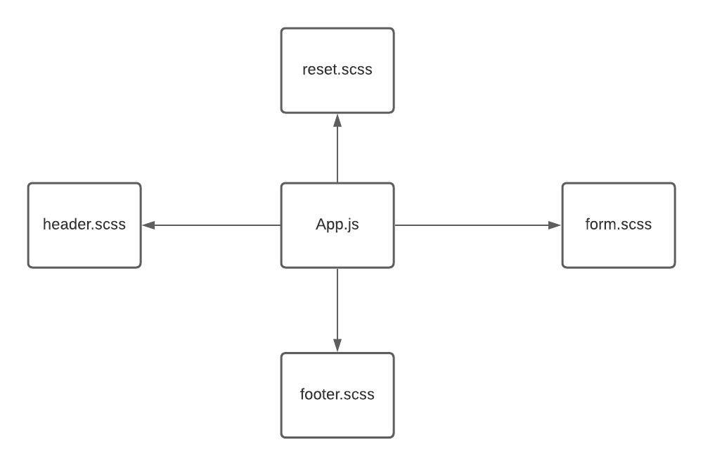

# resty

### Phase 1
#### Begin work on the RESTy API testing application
#### goal is to setup the basic scaffolding of the application, with intent being to add more functionality to the system as we go. This initial build sets up the file structure so that we can progressively build this application in a scalable manner

### Phase 2
#### Connect RESTy with APIs, running live requests
#### , we will be connecting RESTy to live APIs, fetching and displaying remote data. Our primary focus will be to service GET request

